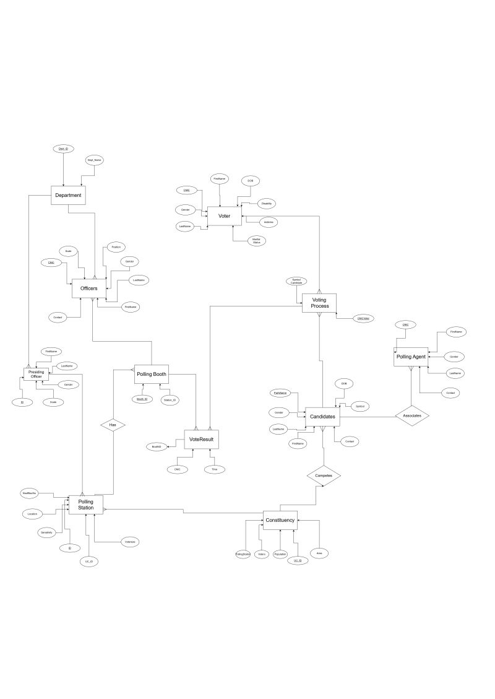
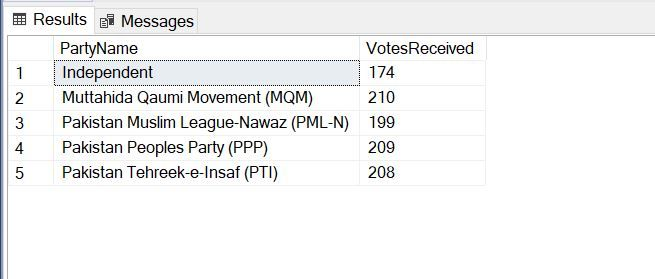
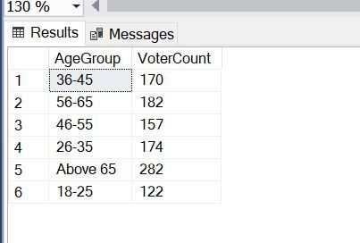

## Voting System Database

Duration: Apr 2024 – May 2024
Institution: COMSATS University Islamabad

## Project Overview

This was a database project where I built a system to manage candidates, voters, polling data, and election results in a more organized way. The primary goal was to make election data easy to handle, accurate, and quickly retrievable. To achieve that, I used SQL features like stored procedures and materialized views to speed up queries and keep the data consistent.

## What I Worked On

1. Designed the database from scratch with both normalized and denormalized schemas so that it could handle real election scenarios smoothly.

2. Wrote stored procedures to automate reporting and reduce manual effort.

3. Used materialized views to make frequently used queries run much faster.

4. Connected the database with Python scripts, which helped in testing, validating, and interacting with the data more easily.

## Images from the Report
Pictures from the main report have been added here for clarity:  

<table>
  <tr>
    <td></td>
    <td></td>
  </tr>
  <tr>
    <td colspan="2"></td>
  </tr>
</table>

## Tech Used
1. SQL (Microsoft SQL Server): Database design, queries.
2. Python: Automation and data interaction

